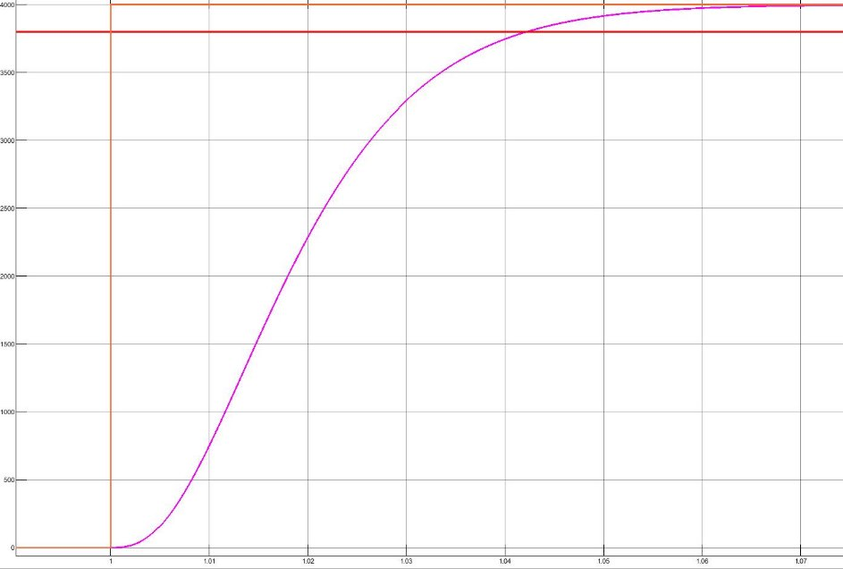
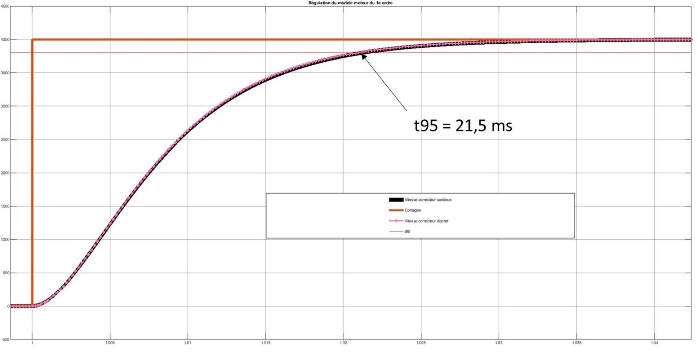
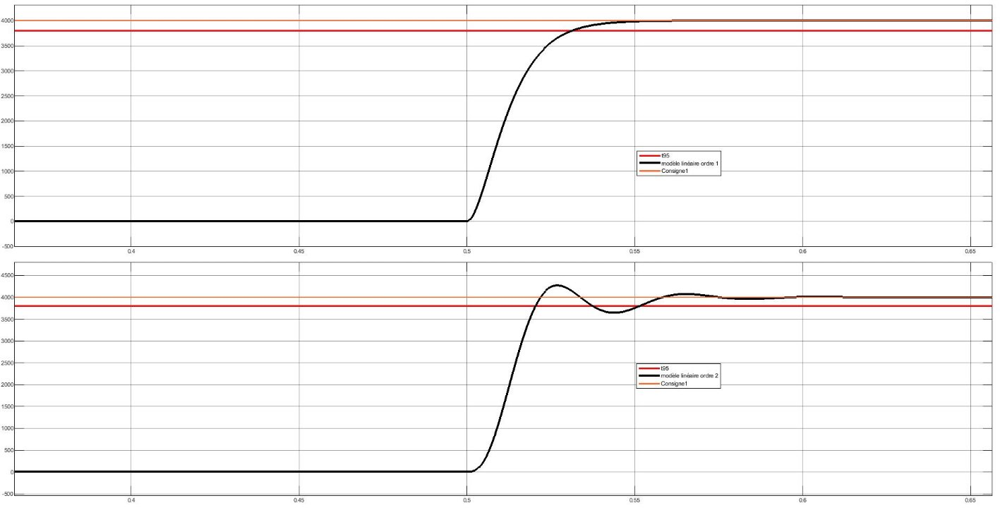
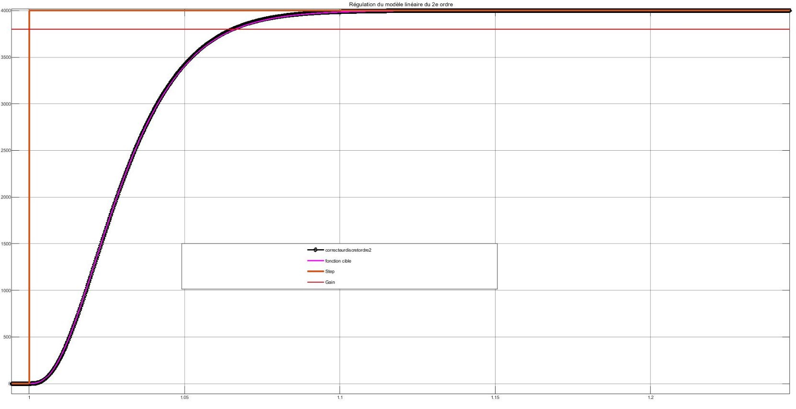
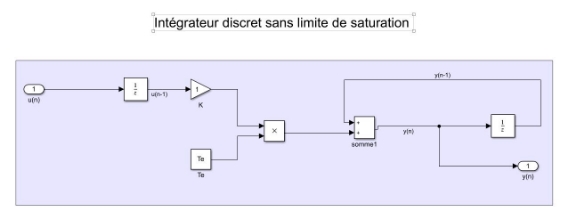

Model of Anti - Windup PI controller for BLDC Motor 

CORRECTEUR LINÉAIRE AVEC INDUCTANCE NÉGLIGÉE 

- **HYPOTHÈSE 1 :  ON NÉGLIGE L’INDUCTANCE DU MOTEUR  **

CORRECTEUR LINÉAIRE AVEC INDUCTANCE NÉGLIGÉE 

Comportement  cible :    1

2 2 + 1 + 1

` `SE 

TEMPS (S)

Paramètre de la fonction cible : Amortissement = 1 

𝑡95% = 3 = 40 ms   

Dimensionnement :

1. Trouver la forme de la fonction de transfert du correcteur
1. Identifier les coefficients à partir des grandeurs physiques et du cahier des charges
1. Vérification de la réponse en continu 
1. Passage du correcteur en discret Fonction de transfert moteur : 
- =

× + ( × + 2)

CORRECTEUR LINÉAIRE AVEC INDUCTANCE NÉGLIGÉE 

Comparaison entre le correcteur continu et discret 

` `SE  

3

TEMPS (S)

CORRECTEUR LINÉAIRE AVEC INDUCTANCE NÉGLIGÉE 

- **RÉSULTAT SUR LES 2 MODÈLES LINÉAIRES**

MODÈLE MOTEUR INDUCTANCE NÉGLIGÉE

VITESSE (RPM)

MODÈLE MOTEUR LINÉAIRE COMPLET

TEMPS (S)

CORRECTEUR LINÉAIRE COMPLET 
|
E :

E DE LA NSFERT DU 

FFICIENTS 

A RÉPONSE EN 

ECTEUR EN URATION 

RT MOTEUR : 
|
| - |
|
2

- × + × +
|
2

- + ( × +
|
- **HYPOTHÈSE 2 : PRISE EN COMPTE DE L’INDUCTANCE** COMPORTEMENT  CIBLE :   K3P3 + 2 2 +K1 + 1

PAR AM

𝑡95% DIM

1. T F
1. I 3.

\4.

` `SE  5.

FON

- =

)

TEMPS (S)

MODÈLE MOTEUR LINÉAIRE COMPLET

DISCRET CONTINU 

` `SE 

TEMPS (S)

ANTI-WINDUP GESTION DE LA SATURATION DE L’INTÉGRATEUR

Anti-saturation en tension/courant (AntiWindup):  En boucle fermée, en rajoutant une saturation en sortie du bloc intégrateur, en cas d’atteinte de limite, la sortie est gelée.   Pour cela, il faut prendre en compte la saturation directement dans le bloc intégrateur.

Correcteur 

Erreur Correcteur Gain Bloc 

Intégrateur DC Intégrateur anti-windup

INTEGRATEUR MODELES SIMULINK

Forward Euler method intégrateur simple : 

y(n) = y(n-1) + K\*Te\*u(n-1)  avec Te = t(n) - t(n-1) y(n) : sortie de l’intégrateur  

Te = t(n) - t(n-1) : période d’echantillonnage, écart de temps  entre 2 point. 

K : gain  

Source : documentation Matlab

Ajout de la gestion de la saturation : 

Let's work linkedin together

16
